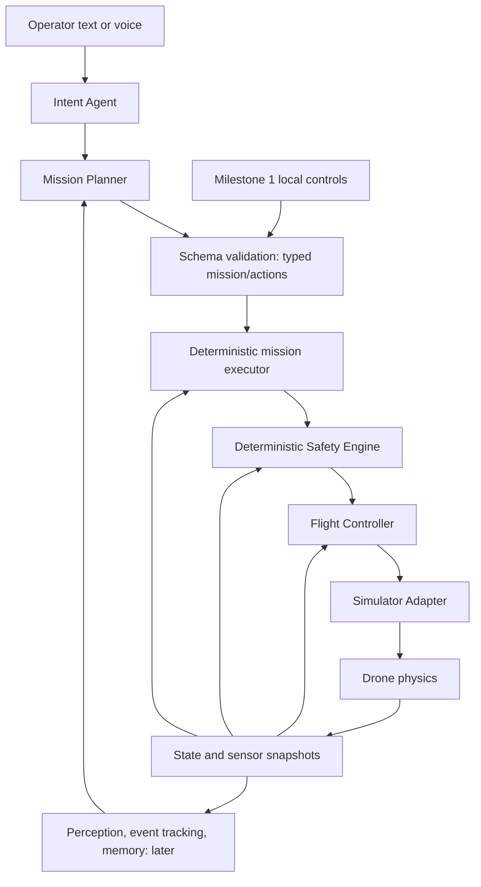

# MicroHawk architecture and development plan

Status: **Approved for Milestone 1 on 2026-09-09, with expanded visual scene content. Later milestones remain proposals.**

Initial repository inspection on 2026-09-09 found only `.git`, an unborn `main` branch, no commits, and no source files or existing project instructions. The initial review added this plan and `AGENTS.md`. The operator subsequently approved M1 while expanding its visual facility content, preserving all original engineering boundaries and requiring a foundation-only tooling checkpoint before Unity project creation. See [tooling and prerequisites](tooling-and-prerequisites.md) for inspection findings. The operator approved the visual/bootstrap result and authorized the physical flight, safety, battery, telemetry and reset pass. See [flight verification](flight-verification.md) for the executed result and [ADR 0002](decisions/0002-physical-flight-foundation.md) for scope adjustments. No commit or push is authorized.

### Approved scope adjustment

M1 is visual-first as well as engineering-first. The facility must already include a recognizable MicroHawk home base/landing pad, warehouse, multiple loading bays, Restricted Zone A floor markings/signage, security gate, structural inspection wall, several visible authored crack/damage markers, static workers/mannequins, static vehicles or forklifts, industrial pipes/tanks/equipment, an obstacle/navigation section, secondary landing/inspection pads and numbered inspection markers. See [M1 visual brief](m1-visual-brief.md) for the acceptance checklist.

All of these are **scene content only**. M1 does not implement or imply perception, object/crack detection, tracking, dwell detection, LLMs or autonomous semantic reasoning. Simulator ground-truth/world metadata remains a separate data path from future perception observations. Future detections must come from sensor inference; semantic tags must not secretly supply the answers. Deterministic safety may use configured geometry and allowed landing sites without claiming perception.

## 1. Architecture

MicroHawk will initially run as a local Unity application. A later local Python process supplies autonomy. They share versioned data contracts, not runtime objects. The simulation must remain usable and testable without Python or a model server.



The mission executor sequences typed actions; it does not steer the drone. In milestone 1 it is only a small action lifecycle coordinator with one active action. Later it executes a validated mission graph, advances on explicit results, and submits replans through the same validation path. Neither planner nor model has a controller/adapter tool.

| Component | Responsibility and ownership |
| --- | --- |
| Intent Agent, later | Resolve operator meaning into constrained mission intent; ask about unresolved locations or goals rather than invent coordinates. |
| Mission Planner, later | Propose versioned plans using known world entity IDs, bounded actions and explicit completion/failure conditions. |
| Mission executor | Own action IDs, sequencing, cancellation, deadlines and terminal results. A replan supersedes a plan revision explicitly. |
| Safety Engine | Deterministically enforce state transitions, geofence, height/speed limits, route clearance and current-state validity. Own reason codes and runtime stop decisions. |
| Flight Controller | Convert authorized position/landing objectives and measured state into bounded flight actuation. No AI dependencies. |
| Simulator Adapter | Own Unity physics access, collision queries and state capture. Apply controller outputs; restore physical state only during lifecycle reset. |
| World registry | Stable IDs, geometry, semantic regions, home and allowed landing sites. Static scene metadata is not a perception result. |
| Telemetry/event sink | Immutable tick-stamped snapshots and action/safety events, visible locally in milestone 1. Later persisted/exported. |
| Perception and temporal events, later | Convert sensor observations into detections/tracks and simulation-time events with confidence and evidence provenance. |
| Mission memory/reporting, later | Store requests, plan revisions, evidence, outcomes and decision records. Explanations cite actual decisions and observations. |

The safety boundary lives next to execution in Unity for the initial simulator; backend preflight validation later is additional defense, never a substitute. The pure C# safety/controller core has no Unity physics dependency. Assembly references isolate presentation from adapter implementation; a composition root supplies narrow interfaces. Only the safety module can construct the internal authorization object accepted by the controller. The runtime host invokes that controller; the adapter receives no raw requests.

For future hardware, preserve the mission/action protocol and replace the execution endpoint. Advertised capabilities determine available actions. A PX4 endpoint delegates low-level stabilization to PX4 and applies corresponding deterministic supervisory policies. Do not force a real autopilot to implement Unity force calls, or promise that every safety implementation is portable without changes. AI layers remain independent of these differences.

## 2. Proposed directory structure

Create directories when used, rather than populating empty future services now.

```text
MicroHawk/
  AGENTS.md
  README.md                                  [M1 setup/run/test]
  docs/
    architecture-plan.md                     [this proposal]
    decisions/                               [accepted ADRs as needed]
    testing.md                               [M1]
  contracts/
    README.md                                [M1 semantics and units]
    schemas/v1/                              [M2 wire schemas]
    fixtures/v1/                             [M2 shared valid/invalid examples]
  simulator/unity/MicroHawkSim/               [M1]
    Assets/MicroHawk/
      Scenes/IndustrialTest.unity
      Prefabs/
      Materials/
      Settings/
      Scripts/
        Contracts/                           [plain C# request/state types]
        Safety/                              [pure policy and authorization]
        Flight/                              [pure controller/state machine]
        Simulation/                          [Unity adapter, clock, reset, host]
        World/                               [entity registry and colliders]
        Presentation/                        [local controls, HUD, cameras]
      Tests/EditMode/
      Tests/PlayMode/
    Packages/                                [manifest and lock]
    ProjectSettings/                         [includes editor version]
  backend/                                   [M2 onward]
    pyproject.toml
    src/microhawk/
      contracts/
      transport/
      missions/
      agents/                                [M4]
      perception/                            [M5]
      memory/                                [M6]
      api/                                   [when dashboard needs it]
    tests/unit/
    tests/integration/
  tools/                                     [repeatable build/test helpers]
```

Use a few purposeful `.asmdef` boundaries corresponding to contracts, safety, flight, Unity runtime and presentation, with separate test assemblies. Avoid one assembly per class. Ignore Unity Library/Temp/Logs/Obj/UserSettings, generated builds, Python environments/caches and runtime evidence. Keep all asset `.meta` files. Add Git LFS only if actual large binary assets require it.

## 3. Development milestones

| Milestone | Deliverable and exit gate |
| --- | --- |
| M1 — Interactive 3D MicroHawk simulation foundation | Standalone Unity scene, safe typed local commands, visible flight, telemetry and reset. Meets the acceptance criteria below. |
| M2 — Python control connection | Versioned schemas, Pydantic models, local transport and deterministic Python command client. Pass round-trip, malformed message, reconnect, duplicate and reset-session tests. No LLM yet. |
| M3 — Deterministic missions | Hand-authored waypoint/patrol plans, action sequencing, evidence capture plumbing, static route planning, extended obstacle responses (the initial battery model/failsafe was brought forward into M1 by operator approval). Demonstrate failures and return behavior without AI. |
| M4 — Constrained language autonomy | Local Ollama intent/planning, bounded plan revisions, optional LangGraph only if its state orchestration is useful. Adversarial/invalid outputs demonstrably cannot bypass policy. |
| M5 — Perception and temporal events | Camera pipeline, vehicles/people, tracking and restricted-zone dwell detection; then calibrated crack/damage inspection. Evaluate against annotated scenarios, with ground truth kept separate. |
| M6 — Operational memory and interaction | Durable mission/evidence store, repeat comparisons, grounded explanations, dashboard and voice. Failure injection/replay scenarios and retention rules. |
| M7 — External flight adapters | Capability negotiation and hardware-specific safety validation for PX4/FlytBase. Separate readiness gate before hardware execution. |

M1 builds all the approved visual facility areas and static props listed above, including workers, vehicles and damage markers. Later milestones add tested perception/mission behavior and eventually moving obstacles; their functionality is not pulled into M1 by the presence of props. Decorative geometry never counts as a working detection or mission capability.

## 4. Dependency strategy

- Select a stable supported Unity 6 editor patch after inspecting the installed tooling; record the exact version in `ProjectVersion.txt`. Do not silently float or upgrade it. Use URP for the initial industrial scene, Unity's built-in 3D physics, a minimal UI and the Unity Test Framework. Pin compatible package versions and retain `packages-lock.json`.
- Use authored primitive/composite meshes initially: warehouse volumes, pavement, dock doors, markings, barriers, equipment and a recognizable four-rotor drone. This avoids mandatory Asset Store downloads. Improve materials, lighting and proportions before adding large art dependencies.
- No Python dependencies in M1. M2 adopts Python 3.11+ with one tested pinned interpreter, Pydantic v2, pytest and one lock workflow (proposed: uv). Add a WebSocket library when transport is implemented. Add FastAPI only for an actual API/dashboard use case.
- Defer Ollama, LangGraph, OpenCV/detectors, speech, databases beyond an initial local store, and all cloud integrations to their milestones. No containers or broker required for initial local execution.
- Document setup-time downloads and licensing separately from runtime: the initial simulator should run offline once installed and built. Select package patches during approved implementation, not from unverified guesses in this proposal.

## 5. Unity/Python communication strategy

M1 implements typed in-process command submission and state/event subscription, plus a documented contract. There is no Python process or network listener in M1.

For M2, propose one persistent versioned JSON WebSocket connection on loopback. Python hosts the endpoint; Unity connects as a client. This avoids requiring a Unity web server. The transport is replaceable behind command/state interfaces. Only one active command authority may control the simulation at a time. Local takeover invalidates remote authority explicitly.

The language-neutral wire specification and JSON Schema are authoritative. Maintain explicit C# and Pydantic models with shared positive/negative fixtures; validate both structural and semantic constraints. Pydantic strict mode alone does not replace unit, frame, finiteness or state checks. AI-specific schemas arrive in M4 and lower only to supported flight actions.

Proposed request envelope: `schema_version`, `session_id`, `command_id`, `sequence`, `issued_at_tick`, `expires_at_tick`, `action_type`, and typed `parameters`. The handshake supplies the current session/tick, capabilities, world/configuration revision and coordinate convention. No transform, motor, code-execution or arbitrary property-setting message exists.

Initial flight actions are `Takeoff`, `MoveTo`, `Land`, `ReturnHome`, and `Hold`. `Hold` decelerates within configured limits; it does not stop instantaneously. Ordinary `Land` accepts only registered landing sites in M1; the approved critical-battery override may use a validated flat footprint. Reset remains local lifecycle administration, outside this command protocol. Wire action/state versions become fixed during M2, after M1 proves the semantics.

Use a facility-local ENU frame: x=east, y=north, z=up, meters; velocities in m/s; angles in radians; yaw zero=east and positive toward north. Unity maps position to `(east, up, north)`. Do not swap quaternion components by guess: convert orientation via an explicit basis transformation and test cardinal directions and rotations. Distinguish pad surface elevation from the drone body reference point. Use simulation ticks and seconds for execution; UTC timestamps are optional audit metadata only.

Responses distinguish receipt from `accepted`, `rejected`, `running`, `succeeded`, `cancelled`, and `failed`, with reason codes and actual completion state. Duplicate IDs with the same payload return the previous result; reused IDs with different payloads are rejected. Reject stale sessions/sequences and expired requests. Never auto-retry a physical action under a new ID after a timeout.

Marshal bounded inbound queues onto the simulation tick; networking never calls Unity objects from its worker thread. Process deterministically by accepted ingress sequence. Telemetry is proposed at 10 Hz over a 50 Hz control tick; coalesce old telemetry under backpressure, preserve bounded action outcomes with explicit overflow faults. Large camera frames use a separate bounded channel later.

On disconnect or stale authority, deterministically enter a controlled hold when feasible and report a fault; do not assume an unchecked return path is safe. Real-time connection liveness becomes a tick-stamped event, while mission timers remain simulation-based. Reconnect requires handshake/state reconciliation and no automatic action resumption. Loopback-only binding plus a per-run credential is the initial access model; LAN deployment requires a separate security design.

## 6. First milestone definition and implementation sequence

**Interactive 3D MicroHawk simulation foundation** is a usable Unity application, not an autonomy demo or a collection of empty interfaces.

1. **Bootstrap:** inspect Unity tooling, choose/pin the editor and packages, create URP project, assembly boundaries, test harness, scene and reproducible settings. Document Play and build commands.
2. **World and visual drone:** construct the polished industrial facility defined in the approved visual brief, including every requested static area/prop. Use coherent scale, materials, lighting, readable signs, floor markings and clear flight corridors. Add a drone body with four rotors, landing gear, colliders, plausible mass/inertia and cosmetic rotor animation. Include overview/follow cameras. A restricted region is initially semantic; independently configure prohibited flight volumes to avoid confusing worker restriction with drone exclusion. Complete visual review alongside flight verification.
3. **Typed control and safety:** implement finite bounded action types, state snapshots, action results, policy checks and a single active-action coordinator. UI provides Takeoff, target x/y/z, Go, Hold, Land, Return Home and a separate Reset control. It submits requests through policy, never changes transforms.
4. **Flight:** use one dynamic Rigidbody with gravity and bounded collective thrust/torque applied by the adapter. Cascaded position/velocity and attitude stabilization targets physically plausible acceleration, tilt and braking. M1 does not simulate individual motor electrical dynamics, aerodynamics or PX4 fidelity. Controller math runs at an initial 0.02 s tick with bounded integrators and outputs; render interpolation is cosmetic. Validate stability as the visual facility develops; neither visual polish nor dynamics verification substitutes for the other.
5. **Navigation and landing:** `MoveTo` follows one clear segment, with clearance based on swept drone volume plus stopping margin. Reject blocked routes; do not add global pathfinding in M1. Return-home expands deterministically into a validated climb/traverse/descent route to the pad. Validate all legs before starting and recheck during execution; if blocked, hold and report the reason. Land only at registered clear sites using vertical descent and contact/settling checks. Ground contact is required to declare landed.
6. **State, telemetry and reset:** expose phase, pose, velocities, active command, target, home, tick/session, clearance and safety reason. Phases are grounded, taking off, holding, moving, returning, landing and faulted with an explicit transition table. The operator brought a deterministic battery model and low/critical failsafes forward into M1; see ADR 0002. Reset stops execution, cancels outstanding commands, clears queues/controller integrators/events, restores body/world configuration and seed, zeros velocities, restarts tick zero and creates a new session. Then re-enable command intake. Camera/UI reset follows the same lifecycle.
7. **Verification and delivery:** pass the acceptance tests, inspect actual Play-mode visuals, produce a desktop build on the available platform and document exact run/reset/test steps and remaining limitations. If editor/build tooling is unavailable, report that limitation; source generation alone does not complete M1.

A single simulation host owns ordering: consume requests, capture state/query geometry, evaluate safety, advance controller, apply actuation, step physics, publish the resulting tick snapshot. Prefer explicit fixed-step `Physics.Simulate` for shared interactive/test stepping; disable automatic stepping and do not run a second controller in `FixedUpdate`. Cap catch-up work and let simulation time lag under overload rather than enlarging the physics timestep.

### M1 acceptance criteria

The numerical values below are proposed test targets to approve and calibrate during the controller work; they are not measured performance claims.

| Check | Required result |
| --- | --- |
| Launch | Open documented Unity version and press Play: visible industrial yard, quadcopter, controls and readable live telemetry; no Python/model dependency. |
| Visual facility | Every area/prop in the approved visual brief is visibly identifiable in Play mode; coherent industrial materials, lighting, scale, markings and signage. Static workers/vehicles and multiple damage markers are present. No detection/semantic-autonomy claim appears in the UI. |
| Takeoff/hold | From pad, reach a target 2 m above the initial body reference height within 10 simulation seconds; maintain position error <=0.2 m and speed <=0.15 m/s for 2 seconds. |
| Move | Traverse a clear 5 m horizontal segment at nominal flight height within 15 simulation seconds; settle within 0.25 m and <=0.15 m/s for 2 seconds, respecting configured speed/tilt bounds. |
| Land | From above a permitted pad, descend and maintain contact with speed <=0.1 m/s for 1 second before declaring grounded and removing thrust. No teleporting. |
| Return home | From a designated clear test location, follow validated return legs and land within 0.3 m horizontally of pad center within 30 simulation seconds. A blocked return is rejected/held explicitly. |
| Safety | Invalid numbers, invalid phase, excessive altitude, outside-fence targets, unsafe landing sites and obstacle-intersecting paths are rejected with reason codes and no unauthorized setpoint change. Grounded Hold cannot start motors. |
| Runtime response | An invalidated route causes bounded braking/hold within the configured stopping envelope in the controlled scenario; contact/unrecoverable state is reported as a fault, not successful completion. No general collision-avoidance guarantee. |
| Action lifecycle | Busy requests reject explicitly; Hold preempts via policy and cancels the previous action. Deadlines terminate actions; success requires measured settling, not elapsed time alone. |
| Reset | Reset during takeoff, motion and landing restores canonical world/drone/controller state. Old commands cannot execute in the new session. Run the same scripted sequence after reset 10 times: same terminal outcomes and checkpoints within 0.05 m on the pinned test environment. |
| Deliverability | EditMode/PlayMode suites pass; actual visual controls work; a desktop build launches; README records editor/package/config versions and known limits. |

## 7. Testing strategy

Use EditMode tests for action validation, state transition tables, authorization gating, velocity/attitude saturation, coordinate conversion, expiry, and deterministic controller calculations with injected state/clock. Use PlayMode tests for Rigidbody dynamics, swept clearance, flight sequences, blocked return, landing contact, telemetry ordering and resets in every active phase. Drive tests by simulation ticks rather than real-time sleeps.

Capture command results, configuration hash, scene version, seed and tick checkpoints on failures. Control/event outputs should match for identical inputs; physical trajectories are compared with explicit tolerances on a pinned platform. M1 reset repeatability is not a complete mission replay feature. Across editor/OS/CPU changes, rerun baselines instead of promising binary-identical physics.

Perform a manual visual checklist for drone visibility/proportions, marked zones, camera usability, collision geometry and control feedback. Automated dynamics tests do not prove the scene looks correct. Later add pytest domain tests, shared JSON fixtures, transport integration tests, malformed/flooded requests and reconnect behavior. Perception milestones require precision/recall, track identity and dwell boundary tests; simulated ground truth supplies evaluation labels, not hidden answers to production perception.

Start with repeatable local test commands. Add repository CI only when runner/editor licensing is available; a missing Unity runner must be reported as an unexecuted check, not a pass. No commit/push is needed to prepare or run local tests.

## 8. Risks and proposed architectural decisions

| Risk / decision | Proposed handling |
| --- | --- |
| PhysX drift vs determinism | Fixed step, fixed ordering, seeded scene, pinned versions; exact logical decisions and tolerance-based physical repeatability. Unity's enhanced determinism is conditional, not a cross-platform promise. |
| Controller instability | Start with a small envelope, bounded gains/integrators and step-response tests. Tune before adding world complexity; preserve dynamic flight rather than hiding instability with transforms. |
| Physics fidelity vs scope | One rigid body with thrust/torque in M1; motor/propeller models require later evidence of need. Simulation is not hardware validation. |
| Clearance and braking | Check volume and stopping distance, not endpoint/raycast alone. Restrict M1 to clear segments; explicitly fail routes that need planning. |
| Safety check becomes stale | Validate at submission and dispatch, monitor each tick, cancel/supersede actions explicitly. No direct controller reference outside trusted runtime composition. |
| Coordinate mismatch | ENU wire/domain frame, explicit Unity basis conversion, cardinal/orientation fixture tests before network work. |
| Contract drift | Versioned canonical schemas and cross-language valid/invalid fixtures; reject incompatible versions. Avoid exposing Unity serialized classes on the wire. |
| Network loss/duplicate execution | Authority lease, bounded queues, session epochs, idempotent IDs and reconciliation; deterministic hold policy. Implement and test in M2. |
| Visual scope and engineering drift | Deliver the full approved static facility and the proven flight loop as separate required acceptance checks. Art is independently reviewed; no claimed perception based on metadata. |
| LLM hallucination/prompt injection, later | Strict bounded actions, known entity IDs, no executable tool payloads, safety checks outside models, adversarial tests. |
| Evidence and dwell timing, later | Simulation clock, track continuity/occlusion rules, evidence provenance and explicit unknown outcomes. |
| Hardware adapter mismatch | Capability-aware execution endpoint with hardware-specific limits; preserve AI contracts while adapting controller responsibilities. |
| Tooling/licensing/performance unknown | Check installed Unity and target machine after approval; document actual build/test results and avoid unmeasured frame-rate guarantees. |

The control boundary, determinism scope and ENU convention are accepted in [ADR 0001](decisions/0001-approved-m1-foundation.md). The documented M2 transport direction remains deferred implementation work. Approval authorizes M1 only unless the operator explicitly broadens scope. The current operator-requested stop point is the verified physical flight, safety, battery, telemetry and reset foundation and its detailed report. Future milestones remain proposals.

## Technical references

These references inform the design; they do not establish that any local implementation exists or passes tests.

- [Unity 6 Physics.Simulate](https://docs.unity3d.com/6000.0/Documentation/ScriptReference/Physics.Simulate.html): explicit stepping and fixed step guidance.
- [Unity 6 physics settings](https://docs.unity3d.com/6000.0/Documentation/Manual/class-PhysicsManager.html): solver configuration and enhanced determinism constraints.
- [Unity Test Framework](https://docs.unity3d.com/Packages/com.unity.test-framework@1.4/manual/index.html): EditMode/PlayMode test tooling; select the compatible package during setup.
- [Pydantic strict mode](https://pydantic.dev/docs/validation/2.12/concepts/strict_mode/): reduced coercion, with type-specific JSON behavior requiring explicit contract tests.


