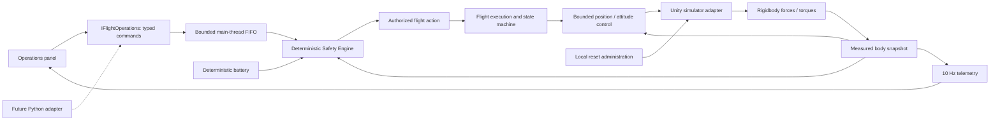

# Physical flight foundation

The approved scene and drone prefab are preserved. This pass adds actual flight and deterministic execution around them. Final test/build evidence is recorded in flight-verification.md.

## Commands, outcomes and state

Commands are sealed typed data classes: Arm, Disarm, Takeoff(altitude), MoveTo(ENU position, optional speed), Hold(optional duration), Land and ReturnHome. No arbitrary command strings, callbacks, code payloads or transform/motor parameters exist. Takeoff altitude is measured above the recorded home body-reference height; MoveTo uses absolute facility-local ENU meters. Null Hold duration means indefinite, interruptible holding. A timed hold accumulates time after physical settling.

Submission is on the Unity main thread, with the expected session number. The service assigns an ID and queues up to 16 commands. Admission happens on the next fixed tick. Outcomes are Accepted, Rejected, Executing, Completed, Failed or Interrupted, carrying session, ID, tick, command kind and reason code. Accepted is not Completed. The future network adapter must marshal inbound work onto this entry point and add wire schema validation, external IDs/idempotency, expiry and reconnect semantics; there is no network listener now.

| State | Behavior / main transitions |
| --- | --- |
| Landed | Motors inactive. Arm requires measured support contact and adequate battery. |
| Armed | Cosmetic rotors rotate; no lifting thrust. Disarm or Takeoff permitted. |
| TakingOff | Physically climb to the validated target; measured settling advances to Hovering. |
| Hovering | Retain position/heading feedback after command completion. Accept MoveTo, Hold, Land or ReturnHome. |
| Flying | Physical target navigation. A validated MoveTo may supersede the active action; Hold/RTH may preempt. |
| Holding | Brake and maintain position. Timed Hold completes after settling; indefinite Hold remains active. |
| ReturningHome | Validated climb and traverse; then transition to Landing over home. |
| Landing | Bounded descent; requires actual support contact, low speed and upright settling before Landed/disarmed. |
| Emergency | Safety override; controlled in-place descent if a flat footprint is validated, otherwise explicit emergency hold. |

State rules live in one table in Safety/FlightStateMachine. Examples rejected: MoveTo while Landed, Takeoff before Arm, Disarm while flying, and operator flight requests during a battery failsafe. Safety-generated overrides are not model-overridable. Superseding actions interrupt the earlier action explicitly. Non-hold actions have a 180 simulation-second deadline; expiry fails the action and requests a safety brake.

## Physical control and timing

The 50 Hz tick consumes commands, evaluates current safety/battery, computes controller output, applies adapter forces/torques, simulates physics, updates battery and publishes telemetry every fifth tick. No transform movement drives flight. The controller uses position-to-velocity feedback, bounded velocity-to-acceleration feedback with a clamped vertical integral, and damped attitude/yaw feedback. Attitude tilts the real Rigidbody so body-axis thrust produces horizontal movement.

Initial tuning: position gain 1.1, velocity gain 2.7, vertical integral gain 0.7, horizontal acceleration <=2.5 m/s², thrust acceleration <=20 m/s², climb <=1.6 m/s, ordinary descent <=0.7 m/s, landing <=0.45 m/s with a gentle final contact request. Attitude gain 26, angular damping 9 and angular acceleration <=15 rad/s². Position/speed settling tolerances are 0.18 m and 0.18 m/s. Touchdown requires support, speed <0.14 m/s, near-upright attitude and 0.8 s settling.

Tune SafetyTuning, ControllerTuning and BatteryTuning on the existing SimulationConfiguration object's SceneConfiguration component. Copies are validated and frozen inside runtime services on reset; press Reset after changing tuning. Invalid configurations fail explicitly. No new asset package is required.

## Safety and battery defaults

| Rule | Default |
| --- | --- |
| Facility fence | East -32..32 m, north -27..27 m, reduced by 0.65 m drone envelope at boundaries |
| Flight target altitude | 1.5..12 m above home body reference |
| Movement speed | Default 2.5 m/s, maximum request 3 m/s |
| Braking allowance | v²/(2 × 2 m/s²) + v × 0.6 s reaction allowance, plus clearance |
| RTH altitude | At least 7 m above home; retain a higher current altitude within limits |
| Takeoff battery | At least 30% |
| Low battery | <=25% triggers RTH, interrupting the previous action |
| Critical battery | <=12% overrides RTH with controlled emergency landing |
| Initial battery | 100% |
| Drain | Landed: 0; armed: 0.005 percentage points/s; airborne: 0.08 + 0.025 × measured speed percentage points/s |

Route admission checks a swept box enclosing the drone and propellers, destination clearance and stopping envelope. Execution rechecks routes against physical colliders. No perception result is inferred from a collider. A newly blocked route fails the prior action and brakes into Hold. RTH validates climb, traverse and descent separately; it does not blindly cross buildings. Low-battery blocked RTH holds and reports the route reason until the critical policy can attempt landing.

Land is allowed near configured home/inspection pads only. Emergency landing probes a flat nine-point footprint and its vertical route. The intended support surface is excluded from the landing collision veto; the braking projection is clamped at the contact plane. Actual collision contacts still determine touchdown. The immutable home point retains the original prefab spawn's 1 cm settling gap, so settled telemetry altitude can read about -0.01 m.

Battery is an explainable simulation percentage, not an electrical/voltage model. Accelerated consumption can be configured for tests. Zero percent does not emulate abrupt electrical power loss; it continues the critical policy. Arbitrary moving-obstacle avoidance, path replanning and guaranteed safe landing in every geometry remain out of scope.

## Telemetry and reset

TelemetrySnapshot schema version 1 exposes session, tick, simulation seconds, ENU position and velocity, body-up/forward orientation basis, axial angular velocity, heading radians, altitude, battery percent, state/armed flag, active command kind/ID, target, home and structured safety status/reason. It is immutable and published at 10 Hz. UI uses this snapshot, not Rigidbody fields. Command outcomes are a separate event stream. Subscriber exceptions are isolated from execution and logged.

Reset is a local lifecycle operation, outside the command interface. It interrupts active/pending work, clears the queue, restores the original body pose/velocities through the adapter, resets contact/controller/battery/state/safety, increments the local session, resets tick/command numbering and publishes a fresh tick-zero snapshot. Requests with the old session reject. Session IDs are local to a runtime instance; network-grade reconnect identity is future adapter work. Ten reset/takeoff repetitions are tested within physical tolerances on the pinned local editor, not bitwise across platforms.

## Operator demonstration

Open IndustrialTest in Unity 6000.6.0f1 and press Play, or run the local Windows build. Use the right-hand panel:

1. Reset, allow the skids to settle, then Arm.
2. Takeoff 4m; wait for Hovering.
3. Inspection wall stand-off; wait for Hovering.
4. Hold, then Return Home.
5. Observe climb, traverse and automatic descent until Landed with armed=false.

Land while hovering over a registered pad performs a direct descent. RTH includes landing; no extra Land command is needed. Buttons for warehouse, loading bays, restricted-zone vicinity, gate and inspection pad submit ordinary MoveTo commands to configured stand-off positions; they do not inspect or detect anything. All routes still undergo admission checks. Cameras use buttons/1/2/Tab. Propeller child meshes rotate while armed; status-light geometry remains cosmetic.

## Limits and next pass

No Python, FastAPI, LLM, LangGraph, voice, computer vision, RAG or FlytBase/PX4 integration exists. No sensor-driven collision avoidance or semantic inspection is claimed. This is a local, single-drone simulation execution endpoint with conservative direct segments and limited emergency behavior, not a certified real-aircraft controller.

After review, the next pass should implement versioned wire schemas, shared positive/negative C#/Pydantic fixtures, a loopback transport adapter, telemetry/outcome streaming and a deterministic Python mission client. Test reconnect, stale state, duplicate requests, malformed payloads and safety rejections before introducing LLM planning or voice.
